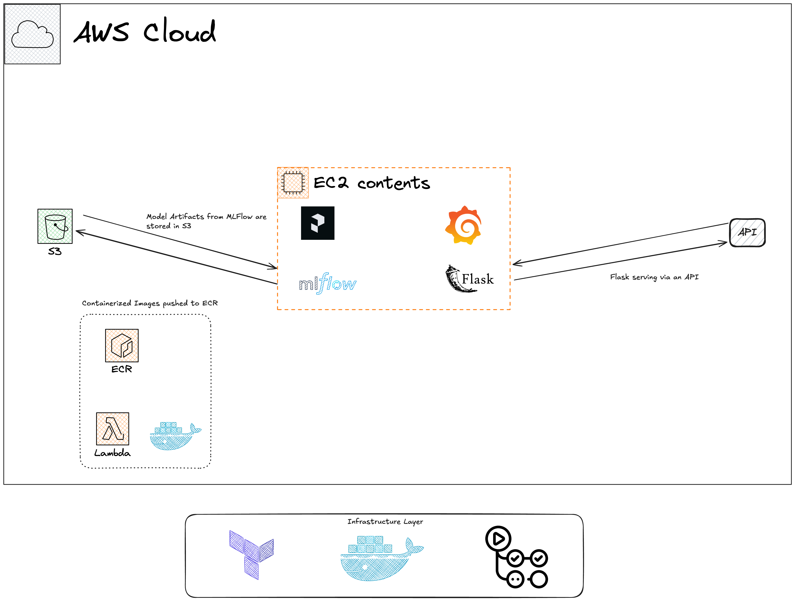

# Coupon Acceptance Prediction Pipeline

## Project Overview
This MLOps project predicts coupon acceptance in vehicles using the XGBoost model. It implements a complete machine learning pipeline, from data preprocessing to model deployment, with a focus on MLOps best practices.


## Architecture



## Data Source
The project uses the "In-Vehicle Coupon Recommendation" dataset from the UCI Machine Learning Repository, providing rich information about users, merchants, and coupon characteristics.

## Key Features
- Destination (No Urgent Place, Home, Work)
- Weather Conditions (Sunny, Rainy, Snowy)
- Time of Day (7AM, 10AM, 2PM, 6PM, 10PM)
- Coupon Categories (Restaurant(<$20), Restaurant($20-$50), Coffee House, Bar, Carry out & Take away)
- Expiration Time (2 hours, 1 day)
- Direction Alignment (Same direction or not)

## Technology Stack
- Python 3.9
- XGBoost for model training
- MLflow 2.4 for experiment tracking and model registry
- Prefect 2.11.2 for workflow orchestration
- Docker for containerization
- AWS (EC2, S3, RDS) for cloud infrastructure
- Terraform for infrastructure as code
- Flask for model serving
- Grafana for monitoring

## Project Structure
```
.
├── .github/workflows/      # CI/CD pipelines
├── .prefect/               # Prefect configurations
├── code/
│   ├── infrastructure/     # Terraform files for AWS setup
│   ├── config/             # Grafana configuration
│   ├── tests/              # Unit tests
│   ├── model.py            # Main model training script
│   ├── model_deployment.py # Model deployment script
│   ├── simu_web_service.py # Web service simulation
│   ├── Dockerfile          # Docker configuration for model serving
│   └── docker-compose.yml  # Docker Compose for multi-container setup
├── .pre-commit-config.yaml # Pre-commit hook configurations
└── prefect.yaml            # Prefect project configuration
```
## Core Components and Workflow
1. **Data Preparation**: Load and preprocess the coupon recommendation data.
2. **Feature Engineering**: Prepare features for model training.
3. **Model Training**: Train XGBoost model with hyperparameter tuning.
4. **Experiment Tracking**: Use MLflow to log parameters, metrics, and artifacts.
5. **Workflow Orchestration**: Manage the pipeline with Prefect.
6. **Model Deployment**: Serve the model using Flask and Docker.
7. **Monitoring**: Visualize model performance and system metrics with Grafana.

## Setup and Usage
For detailed setup instructions, please refer to the [code/README.md](code/README.md) file. It covers:

1. Environment setup and dependency installation
2. AWS resource provisioning with Terraform
3. MLflow tracking server setup
4. Prefect workflow configuration
5. Model training and hyperparameter tuning
6. Model deployment using Docker
7. Making predictions with the deployed service


## Development Flow and CI/CD Process

1. **Local Development**:
   - Developers work on feature branches
   - Use pre-commit hooks for code quality checks
   - Run unit tests locally

2. **Code Push and CI**:
   - When code is pushed to GitHub, CI pipeline is triggered
   - GitHub Actions run automated tests and linting
   - If tests pass, the code is approved for review

3. **Code Review and Merge**:
   - Pull requests are created for feature branches
   - Code is reviewed by team members
   - Once approved, code is merged into the main branch

4. **Continuous Deployment**:
   - Merges to main branch trigger the CD pipeline
   - CD pipeline builds the Docker image
   - New image is pushed to container registry
   - Terraform applies any infrastructure changes
   - New version of the application is deployed to staging environment

5. **Model Training and Experimentation**:
   - Data scientists use Prefect to orchestrate model training workflows
   - Experiments are tracked using MLflow
   - Best performing models are registered in the MLflow Model Registry

6. **Production Deployment**:
   - After validation in staging, manual approval triggers production deployment
   - Latest model is pulled from MLflow Model Registry
   - Docker image is updated with new model
   - Production environment is updated with new image

7. **Monitoring and Feedback**:
   - Grafana dashboards monitor model performance and system health
   - Feedback loop allows for continuous improvement of the model


## Model Re-training Flow

The coupon acceptance prediction pipeline in this project is implemented using a combination of MLOps tools and practices. Here's a breakdown of how the pipeline works:

1. Data Ingestion and Preprocessing:
   - The `read_data` function loads the coupon recommendation dataset from a ZIP file.
   - It renames some columns and selects relevant features.

2. Data Splitting and Feature Engineering:
   - The `prepare_data_valid_set` function splits the data into training, validation, and test sets.
   - It uses DictVectorizer to convert categorical features into a format suitable for machine learning.

3. Model Training:
   - The `train_best_model` function trains an XGBoost model using the prepared data.
   - It uses MLflow to log parameters, metrics, and artifacts during the training process.

4. Hyperparameter Tuning:
   - The main flow allows for hyperparameter tuning by accepting parameters like learning rate, max depth, etc.
   - These parameters can be adjusted via command-line arguments.

5. Model Evaluation:
   - The pipeline calculates the AUC score on the validation set to evaluate model performance.

6. Experiment Tracking:
   - MLflow is used throughout the pipeline to track experiments, including hyperparameters, metrics, and model artifacts.

7. Workflow Orchestration:
   - The entire pipeline is orchestrated using Prefect, with different steps defined as tasks and the overall flow defined in `main_flow`.

8. Model Persistence:
   - The trained model and preprocessor are saved using MLflow, making them easy to load for deployment.

9. Reporting:
   - A markdown report is generated with the AUC score, which can be used for easy visualization of results.

10. Flexibility for Testing:
    - The pipeline includes an option to prepare and save test data for final model evaluation.

This pipeline ensures a streamlined process from data ingestion to model training and evaluation, with built-in experiment tracking and workflow management. It's designed to be reproducible and easily adjustable for different hyperparameters or datasets.

This pipeline uses a combination of techniques to handle these drifts:
1. Continuous Monitoring: MLflow and Prefect are used to continuously track model performance and data statistics.

2. Automated Retraining: When drift is detected, the pipeline can automatically trigger model retraining using the latest data.

3. Versioning: All models and datasets are versioned, allowing for easy rollback if needed.

4. Alerting: The system generates alerts when significant drift is detected, allowing for human intervention when necessary.

5. Adaptive Feature Engineering: The feature engineering process can be adjusted based on detected drifts.
